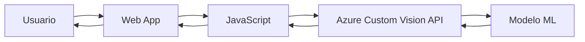

# 🌺 Identificador de Flores - Jardín Botánico RD

<div align="center">
  
  
  
  
  
  ### 🤖 Identificación inteligente de flores usando Azure AI
  
  [🌐 Ver Demo en Vivo](https://jardinbotanicoai.netlify.app/) | [📝 Reportar Bug](../../issues) | [✨ Solicitar Feature](../../issues)
  
</div>

---

## 📖 Descripción

Una aplicación web inteligente que identifica automáticamente 5 tipos de flores usando **Azure Custom Vision**. Los usuarios pueden subir imágenes o proporcionar URLs, y el sistema devuelve la clasificación con su nivel de confianza.

Cuando se detecta una imagen que no es una flor válida, el sistema muestra una advertencia visual personalizada con retroalimentación clara para el usuario.

> 💡 **Proyecto académico** desarrollado para la materia de Inteligencia Artificial, implementando servicios cloud de Microsoft Azure y Machine Learning supervisado.

---

## ✨ Características

### 🌸 Flores Identificables
- 🌼 **Daisy** (Margarita)
- 🌻 **Dandelion** (Diente de león)
- 🌹 **Rose** (Rosa)
- 🌻 **Sunflower** (Girasol)
- 🌷 **Tulip** (Tulipán)

### 🎯 Funcionalidades
- ✅ Subida de imágenes desde dispositivo local
- ✅ Análisis mediante URL de imagen
- ✅ Vista previa automática antes de analizar
- ✅ Detección de imágenes no válidas
- ✅ Interfaz responsiva y moderna
- ✅ Integración directa con Azure Custom Vision API
- ✅ Resultados con porcentaje de confianza
- ✅ Manejo robusto de errores

---

## 🛠️ Tecnologías

### ☁️ Cloud & AI
- **Azure Custom Vision** - Entrenamiento del modelo
- **Azure Prediction API** - Servicio de predicción
- **Azure Cognitive Services** - Infraestructura de IA

### 💻 Frontend
- **HTML5** - Estructura
- **CSS3** - Estilos y animaciones
- **JavaScript (ES6+)** - Lógica de aplicación
- **Fetch API** - Comunicación con Azure
- **Bootstrap Icons** - Iconografía

### 🚀 Deployment
- **Netlify** - Hosting y despliegue continuo

---

## 🏗️ Arquitectura



### Capas del Sistema
1. **Capa de Datos** - Dataset de flores de Kaggle
2. **Capa de Procesamiento** - Modelo de clasificación entrenado
3. **Capa de Publicación** - API de predicción en Azure
4. **Capa de Consumo** - Aplicación web en Netlify

---

## 📁 Estructura del Proyecto

```
Proyecto-Jardin-BotanicoRD/
│
├── index.html              # Página principal
├── script.js               # Lógica de la aplicación
├── styles.css              # Estilos personalizados
│
└── img/                    # Recursos visuales
    ├── favicon.png
    ├── no_flor.png
    └── ...
```

---

## 📊 Dataset

**Fuente:** [Flowers Recognition - Kaggle](https://www.kaggle.com/datasets/alxmamaev/flowers-recognition)

El modelo fue entrenado con un dataset curado que incluye imágenes de alta calidad de las cinco especies de flores seleccionadas. Se realizó:
- 🧹 Limpieza de datos
- 📂 Clasificación por categorías
- ⬆️ Carga y etiquetado en Azure Custom Vision

---

## 🔧 Cómo Funciona el Modelo

1. **Predicción**: Las imágenes se analizan mediante el modelo entrenado
2. **Ordenamiento**: Se ordenan las predicciones por probabilidad
3. **Umbral**: Se aplica un umbral mínimo de **40% de confianza**
4. **Validación**: Se verifica que el tag predicho esté dentro de las flores entrenadas
5. **Resultado**: 
   - ✅ Si coincide → Muestra la flor identificada con su probabilidad
   - ❌ Si no coincide → Muestra `no_flor.png` + mensaje de advertencia

---

## 🚀 Instalación y Uso

### Opción 1: Usar la Demo en Línea
Simplemente visita: [https://jardinbotanicoai.netlify.app/](https://jardinbotanicoai.netlify.app/)

### Opción 2: Ejecutar Localmente

1. **Clonar el repositorio**
```bash
git clone https://github.com/AnthonyGzm/Proyecto-Jardin-BotanicoRD.git
cd Proyecto-Jardin-BotanicoRD
```

2. **Abrir la aplicación**
```bash
# Simplemente abre index.html en tu navegador
# O usa un servidor local como Live Server en VS Code
```

3. **Usar la aplicación**
   - Selecciona una imagen desde tu dispositivo, **o**
   - Pega la URL de una imagen en línea
   - Haz clic en "Identificar"
   - ¡Observa los resultados!

---

## 📸 Capturas de Pantalla

### Interfaz Principal


### Identificación Exitosa


### Detección de Imagen No Válida


---

## 🧪 Ejemplos de Prueba

Para probar la aplicación, puedes usar URLs de imágenes de flores o subir tus propias fotos. El sistema identificará automáticamente si la imagen corresponde a una de las cinco especies entrenadas.

**Flores soportadas:**
- Margaritas (Daisy)
- Dientes de león (Dandelion)
- Rosas (Rose)
- Girasoles (Sunflower)
- Tulipanes (Tulip)

---


## 👥 Autores

- **Anthony Guzmán** - *Estudiante ITLA* - [@AnthonyGzm](https://github.com/AnthonyGzm)
- **Mario Suero** - *Estudiante ITLA*  - [@K1lluaZk](https://github.com/K1lluaZk)
- **Albert ** - *Estudiante ITLA*  - [@Fenndy999](https://github.com/Fenndy999)

---

## 📄 Licencia

Este proyecto está bajo la Licencia MIT - ver el archivo [LICENSE](LICENSE) para más detalles.

---


<div align="center">
  
  ### ⭐ Si te gustó este proyecto, dale una estrella!
  
  Hecho con 💚 y en República Dominicana
  
</div>
